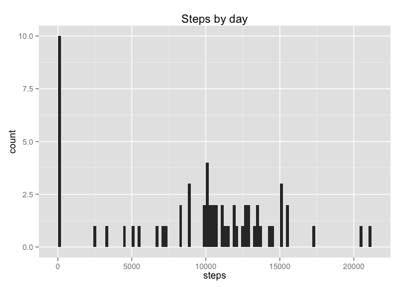
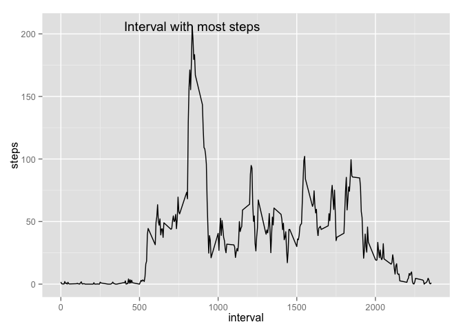
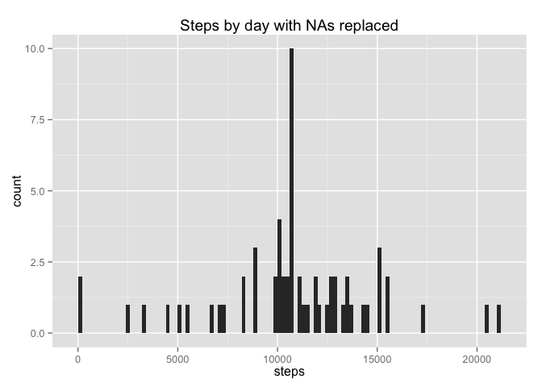

# Reproducible Research: Peer Assessment 1

Change the path of the figures, set warnings to false and set the default formatting config

```r
knitr::opts_chunk$set(fig.path='figure/', warning=FALSE, message=FALSE)

inline_hook <- function(x){
  if(is.numeric(x)){
    paste(format(x,digits=2))
  }
}

knitr::knit_hooks$set(inline=inline_hook)
```

## Loading and preprocessing the data

Read the CSV data directly from the activity.zip file

```r
data <- read.csv(unz("activity.zip", "activity.csv"))
```

Convert the date column to POSIXct

```r
data$date <- as.POSIXct(data$date)
```

Perform a basic inspection of the data

```r
head(data)
```

```
##   steps       date interval
## 1    NA 2012-10-01        0
## 2    NA 2012-10-01        5
## 3    NA 2012-10-01       10
## 4    NA 2012-10-01       15
## 5    NA 2012-10-01       20
## 6    NA 2012-10-01       25
```


## What is mean total number of steps taken per day?

Load the required libraries

```r
library(plyr)
library(ggplot2)
```

Generate an aggregate of the steps by day

```r
steps_by_day <- aggregate(data$steps, by = list(data$date), sum, na.rm=TRUE) 
```

Rename the column headers into something human readable

```r
names(steps_by_day) <- c("date","steps")
```

Create and display the plot

```r
steps_by_day_plot <- ggplot(steps_by_day,aes(x = steps)) +
       ggtitle("Steps by day") +
       xlab("steps") + ylab("count") +
       geom_histogram(binwidth = 200)
steps_by_day_plot
```

 

Calculate the mean and the median

```r
mean_steps_by_day   <- round(mean(steps_by_day$steps , na.rm = TRUE))
median_steps_by_day <- round(median(steps_by_day$steps , na.rm = TRUE))
```
The mean steps by day is 9354 whilst the median steps by day is 10395

## What is the average daily activity pattern?


Generate a dataset containing the means steps per interval and rename the output columns

```r
mean_interval_steps <- aggregate(data$steps, by = list(data$interval), mean, na.rm=TRUE)
names(mean_interval_steps) <- c("interval","steps")
```

Determine the 5 minute interval with the most steps and determine the max steps

```r
max_steps                <- max(mean_interval_steps$steps);
interval_with_most_steps <- mean_interval_steps[which.max(mean_interval_steps$steps),c("interval")]
```

Plot the output

```r
mean_interval_steps_plot <- ggplot(mean_interval_steps,aes(interval,steps)) + 
                            geom_line() + 
                            annotate("text", x = interval_with_most_steps, y= max_steps, label = "Interval with most steps")
mean_interval_steps_plot 
```

 

The 5 minute interval with the most steps is 835

## Imputing missing values

Calculate the number of missing values

```r
sum_missing_values <- sum(is.na(data$steps))
```
The number of missing values is 2304

Install plyr to help us deal with replacement of missing values

```r
library(plyr)
```

Compensate for missing data and fill in the missing values using the mean of the dataset. 

```r
replace_element_with_mean <- function(element) {
  replace(element, is.na(element), mean(element, na.rm = TRUE))
}
clean_data <- ddply(data, ~interval, transform, steps = replace_element_with_mean(steps))
head(clean_data)
```

```
##       steps       date interval
## 1  1.716981 2012-10-01        0
## 2  0.000000 2012-10-02        0
## 3  0.000000 2012-10-03        0
## 4 47.000000 2012-10-04        0
## 5  0.000000 2012-10-05        0
## 6  0.000000 2012-10-06        0
```


Produce a sum aggregate by day

```r
clean_steps_by_day        <- aggregate(clean_data$steps, by = list(clean_data$date), sum) 
names(clean_steps_by_day) <- c("date","steps")
```

Plot the result

```r
clean_steps_by_day_plot   <- ggplot(clean_steps_by_day,aes(x = steps)) +
       ggtitle("Steps by day with NAs replaced") +
       xlab("steps") + ylab("count") +
       geom_histogram(binwidth = 200)
clean_steps_by_day_plot
```

 

Recompute the mean and the median

```r
clean_mean_steps_by_day   <- round(mean(clean_steps_by_day$steps ))
clean_median_steps_by_day <- round(median(clean_steps_by_day$steps))
```

The mean before and after is 9354 and 10766 respectively whilst the media before and after is 10395 and 10766 respectively.

## Are there differences in activity patterns between weekdays and weekends?
